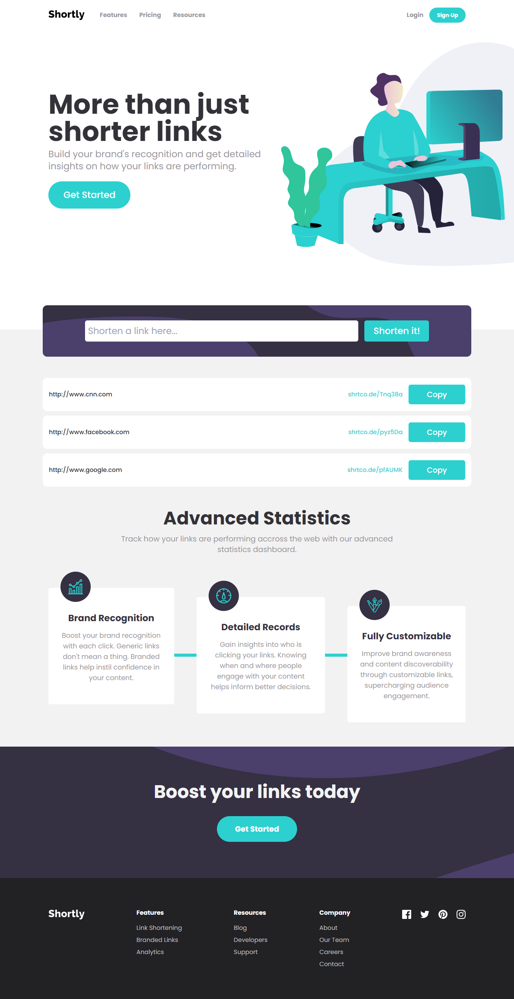

# Shortly URL shortening API Challenge

## Table of contents

- [Overview](#overview)
  - [The challenge](#the-challenge)
  - [Screenshot](#screenshot)
  - [Links](#links)
- [My process](#my-process)
  - [Built with](#built-with)
  - [What I learned](#what-i-learned)
  - [Useful resources](#useful-resources)
- [Author](#author)
- [Acknowledgments](#acknowledgments)


## Overview

### The challenge

Users should be able to:

- View the optimal layout for the site depending on their device's screen size
- Shorten any valid URL
- See a list of their shortened links, even after refreshing the browser
- Copy the shortened link to their clipboard in a single click
- Receive an error message when the `form` is submitted if:
  - The `input` field is empty

### Screenshot




### Links
- Live Site URL: [Vercel](https://your-live-site-url.com)

## My process

### Built with

- React JS
- Tailwind CSS
- Flexbox
- Mobile-first workflow
- Local Storage


### What I learned
One thing I learned is how to make localStorage calls when the SearchBar componenent loads on the page.
I also got more experience using the useEffect react state hook.

```js
 useEffect(() => {
    const sitesData = JSON.parse(localStorage.getItem('websites'));
    if (sitesData) {
      setSites(sitesData);
    }
  }, []);
```

```js
 useEffect(() => {
    const sitesData = JSON.parse(localStorage.getItem('websites'));
    if (sitesData) {
      setSites(sitesData);
    }
  }, []);
```


### Useful resources

- [How to Use localStorage with React Hooks to Set and Get Items](https://www.freecodecamp.org/news/how-to-use-localstorage-with-react-hooks-to-set-and-get-items/) - This helped me wrap my head around using local storage in React. I really liked this pattern and will use it going forward.

## Author

- Author - [Rodderick Garland](https://www.rodthedev.com)


## Acknowledgments

Much thanks to [Tyrell Curry](https://github.com/tyrellcurry) for collaborating with me on this project. 
